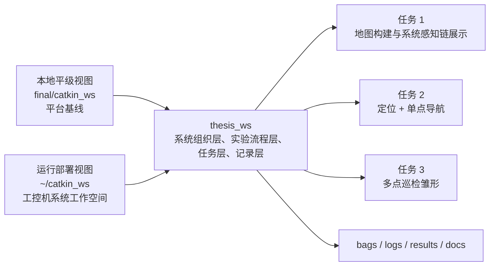

# thesis_ws 与 catkin_ws 的平级工作空间模型

## 核心定位

- 本地 `catkin_ws`：平台工作空间镜像/参考基线，用于提供底层能力、分析、梳理、对照
- `thesis_ws`：毕业设计主工作空间

需要明确区分两套语境：

- 本地平级视图：`final/catkin_ws` 与 `final/thesis_ws` 平级存在，便于在本地复用平台能力并组织 thesis 侧结构
- 实际部署视图：工控机上的 `~/catkin_ws` 与 `~/thesis_ws` 也平级存在，thesis_ws 依赖的是系统环境中的平台能力，而不是任何旧的参考目录模型

现在本地结构已经与工控机部署模型基本一致，后续构建应优先围绕这种平级关系展开。



## 为什么要双工作空间

- 平台侧已经完成 Stage 1，建图链和导航上游已跑通，不应在 thesis 阶段继续大改。
- 毕设主线需要的是上层实验组织与结果沉淀，而不是继续把时间消耗在平台底层重构上。
- 将 thesis_ws 独立出来后，建图、定位导航、巡检任务可以用同一套结构承接，而不会污染基线。

## 本地结构与实际部署结构

本地结构：

```text
final/
├── catkin_ws/
└── thesis_ws/
```

这个结构的存在原因是：

- 便于在本地保留一份平台工作空间镜像/参考基线
- 便于在本地复用和核对现有 launch、param、topic、TF 和地图组织方式
- 便于为 thesis_ws 建立自己的系统骨架和文档约束

需要明确的是：

- thesis_ws 可以复用本地平级 `catkin_ws` 提供的能力
- thesis_ws 不能依附到 `catkin_ws` 目录内部组织自己的系统入口
- launch 和 config 不能把 thesis_ws 的运行前提写成某种固定的本地相对路径耦合

实际部署结构：

```text
~/catkin_ws
~/thesis_ws
```

这两个工作空间在工控机上应按平级关系理解。thesis_ws 可以参考并复用系统 `catkin_ws` 暴露的包、topic、tf 和 launch 组织方式，但不能在语义上绑定某个旧的 `reference` 目录模型。

## thesis_ws 的职责分解

- 系统启动封装：通过 wrapper launch 接入平台能力
- 实验流程组织：按 task1 / task2 / task3 组织入口
- 任务点组织：用 waypoint 文件表达巡检点和任务语义
- 记录与结果沉淀：统一 bag、log、result、map 输出位置
- 文档与接口说明：固定边界，降低后续开发漂移

## 路径与部署原则

- 本地 `catkin_ws` 提供平级平台能力与结构参考，但 thesis_ws 不依附于它的目录内部。
- thesis_ws 的 launch 应依赖 ROS 包查找、topic、tf 和 source 后的环境，不依赖任何旧的 `reference` 相对路径。
- thesis_ws 的 map、config、task、bag、log、result 应由 thesis_ws 自己管理。
- 后续联调与部署默认面向工控机上的平级工作空间组织。

## Task1 在 thesis_ws 中的角色

Task1 是 thesis_ws 中第一条正式收口的实验链，目标不是调优建图算法，而是让 thesis_ws 接管：

- 建图场景入口
- 平台能力接入编排
- RViz 观察入口
- 地图输出规范
- 最小结果归档规范

当前 Task1 的组织方式是：

- `scenarios/task1_mapping_session.launch`：正式场景入口
- `platform/reference_sensing_bridge.launch`：平台感知接入
- `platform/reference_mapping_core.launch`：建图核心
- `tools/rviz_session.launch`：观察入口
- `tools/record_session.launch`：最小记录入口
- `maps/generated/`：地图输出目录
- `results/mapping/`：结果归档目录

## 为什么不能直接把官方耦合 launch 当 thesis 正式入口

从本地平级 `catkin_ws` 的上游结构现状看：

- `scout_bringup/open_rslidar.launch` 会直接拉起雷达、点云转激光、静态 TF、RF2O 和模型显示
- `scout_bringup/gmapping.launch` 会把 gmapping 和 RViz 直接绑在一起
- `scout_bringup/navigation_4wd.launch` 会把 map_server、AMCL、move_base、RViz、底盘 bringup 绑在一起

这些入口适合平台 demo，不适合论文系统长期维护，因为它们没有把以下责任清晰拆开：

- 地图选择
- 任务入口命名
- 参数 overlay
- bag/log/result 输出
- 后续 waypoint 巡检任务扩展

因此 thesis_ws 采用“catkin_ws 提供底层能力，thesis_ws 提供系统组织”的策略。

## 后续构建约束

- 后续功能接入时，默认使用工控机的平级部署模型，而不是本地仓库模型。
- 可以持续参考本地 `catkin_ws` 的结构与接口，但不能把 thesis_ws 写成依附于 catkin_ws 内部目录的系统。
- 若下一轮开始联调，应优先验证工控机上的实际包名、topic、tf 和工作空间关系。
