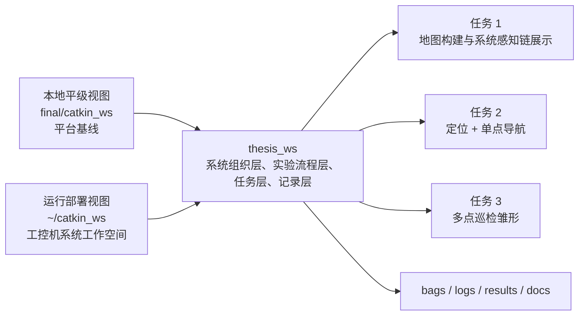

# thesis_ws 与 catkin_ws 的平级工作空间模型

## 核心定位

- 本地 `catkin_ws`：平台工作空间镜像/参考基线，用于提供底层能力、分析、梳理、对照
- `thesis_ws`：毕业设计主工作空间

需要明确区分两套语境：

- 本地平级视图：`final/catkin_ws` 与 `final/thesis_ws` 平级存在，便于在本地复用平台能力并组织 thesis 侧结构
- 实际部署视图：工控机上的 `~/catkin_ws` 与 `~/thesis_ws` 也平级存在，thesis_ws 依赖的是系统环境中的平台能力，而不是任何旧的参考目录模型

现在本地结构已经与工控机部署模型基本一致，后续构建应优先围绕这种平级关系展开。



## 为什么要双工作空间

- 平台侧已经完成 Stage 1，建图链和导航上游已跑通，不应在 thesis 阶段继续大改。
- 毕设主线需要的是上层实验组织与结果沉淀，而不是继续把时间消耗在平台底层重构上。
- 将 thesis_ws 独立出来后，建图、定位导航、巡检任务可以用同一套结构承接，而不会污染基线。

## 本地结构与实际部署结构

本地结构：

```text
final/
├── catkin_ws/
└── thesis_ws/
```

这个结构的存在原因是：

- 便于在本地保留一份平台工作空间镜像/参考基线
- 便于在本地复用和核对现有 launch、param、topic、TF 和地图组织方式
- 便于为 thesis_ws 建立自己的系统骨架和文档约束

需要明确的是：

- thesis_ws 可以复用本地平级 `catkin_ws` 提供的能力
- thesis_ws 不能依附到 `catkin_ws` 目录内部组织自己的系统入口
- launch 和 config 不能把 thesis_ws 的运行前提写成某种固定的本地相对路径耦合

实际部署结构：

```text
~/catkin_ws
~/thesis_ws
```

这两个工作空间在工控机上应按平级关系理解。thesis_ws 可以参考并复用系统 `catkin_ws` 暴露的包、topic、tf 和 launch 组织方式，但不能在语义上绑定某个旧的 `reference` 目录模型。

## thesis_ws 的职责分解

- 系统启动封装：通过 wrapper launch 接入平台能力
- 算法增强层：通过 thesis 自己的节点接入感知前端或任务执行增强逻辑
- 实验流程组织：按 task1 / task2 / task3 组织入口
- 任务点组织：用 waypoint 文件表达巡检点和任务语义
- 记录与结果沉淀：统一 bag、log、result、map 输出位置
- 文档与接口说明：固定边界，降低后续开发漂移

## 路径与部署原则

- 本地 `catkin_ws` 提供平级平台能力与结构参考，但 thesis_ws 不依附于它的目录内部。
- thesis_ws 的 launch 应依赖 ROS 包查找、topic、tf 和 source 后的环境，不依赖任何旧的 `reference` 相对路径。
- thesis_ws 的 map、config、task、bag、log、result 应由 thesis_ws 自己管理。
- 后续联调与部署默认面向工控机上的平级工作空间组织。

## Task1 在 thesis_ws 中的角色

Task1 是 thesis_ws 中第一条正式收口的实验链，目标不是调优建图算法，而是让 thesis_ws 接管：

- 建图场景入口
- 平台能力接入编排
- RViz 观察入口
- 地图输出规范
- 最小结果归档规范

当前 Task1 的组织方式是：

- `scenarios/task1_mapping_session.launch`：正式场景入口
- `platform/reference_sensing_bridge.launch`：平台感知接入
- `platform/thesis_scan_frontend.launch`：第一条实验线的扫描增强前端
- `platform/reference_mapping_core.launch`：建图核心
- `tools/rviz_session.launch`：观察入口
- `tools/record_session.launch`：最小记录入口
- `maps/generated/`：地图输出目录
- `results/mapping/`：结果归档目录

## Task2 在 thesis_ws 中的角色

Task2 是 thesis_ws 中第二条正式收口的实验链，目标不是优化导航效果，而是让 thesis_ws 接管：

- 当前活动地图引用
- 定位与导航场景入口
- RViz 观察入口
- 导航结果归档规范

当前 Task2 的组织方式是：

- `scenarios/task2_single_goal_nav.launch`：正式场景入口
- `platform/thesis_scan_frontend.launch`：第一条实验线中按需启用的扫描增强前端
- `platform/reference_localization_nav_core.launch`：`map_server + amcl + move_base`
- `tools/rviz_session.launch`：观察入口
- `tools/record_session.launch`：最小记录入口
- `config/maps/map_refs.yaml`：地图索引
- `scripts/run_task2_active_map.sh`：active map 启动脚本
- `results/navigation/`：结果归档目录

## Task3 在 thesis_ws 中的角色

Task3 是 thesis_ws 中长出 thesis 自己任务逻辑主体的入口。A1 阶段的目标不是完成复杂巡检策略，而是先让 thesis_ws 拥有自己的任务执行器，并把 waypoint 巡检、状态流、失败处理和结果沉淀从平台 demo 外部接管回来。

当前 Task3 的组织方式是：

- `scenarios/task3_patrol_stub.launch`：Task3 A1 正式场景入口
- `platform/reference_localization_nav_core.launch`：继续复用平台的 `map_server + amcl + move_base`
- `src/thesis_tasks/scripts/task_manager_node.py`：thesis 自己的任务执行器
- `tasks/waypoint_sets/`：任务文件与 waypoint 集合
- `config/tasks/patrol_manager_params.yaml`：默认任务执行参数
- `results/patrol/`：巡检摘要与实验结果目录

Task3 后续新增的 coverage 增强层采用 thesis 侧离线生成方式：

- `tasks/coverage_sets/`：coverage 输入配置
- `config/tasks/coverage_schema.yaml`：coverage 数据约束
- `src/thesis_tasks/scripts/coverage_path_generator.py`：coverage generator
- `scripts/generate_task3_coverage_task.sh`：coverage 生成辅助脚本
- `tasks/waypoint_sets/`：coverage 生成后的标准 waypoint YAML

当前 coverage 口径固定为：

- 不改 `move_base`
- 不新增复杂在线规划节点
- 先只支持矩形区域
- 先只生成弓形 waypoint
- 然后继续复用 `task_manager_node.py`

## thesis 自有实验线

当前 thesis_ws 内部已经形成两条由 thesis 自己管理的实验线：

- 第一条实验线：扫描前端增强
  - 入口核心：`platform/thesis_scan_frontend.launch`
  - 作用位置：Task1 建图链、Task2 定位导航链
  - 对比方式：baseline 使用 `/scan`，enhanced 使用 `/scan_thesis`
- 第二条实验线：任务级导航执行增强
  - 入口核心：`src/thesis_tasks/scripts/task_manager_node.py`
  - 作用位置：Task3 waypoint 巡检执行链
  - 对比方式：baseline 使用直接单阶段目标执行；enhanced 增加阶段控制、进度监测、卡滞恢复与 thesis 接受判定
- Task3 coverage 增强：离线矩形区域覆盖生成
  - 入口核心：`src/thesis_tasks/scripts/coverage_path_generator.py`
  - 作用位置：Task3 执行前的任务生成层
  - 工作方式：coverage config -> bow waypoint yaml -> 复用现有 patrol 执行链

## 为什么不能直接把官方耦合 launch 当 thesis 正式入口

从本地平级 `catkin_ws` 的上游结构现状看：

- `scout_bringup/open_rslidar.launch` 会直接拉起雷达、点云转激光、静态 TF、RF2O 和模型显示
- `scout_bringup/gmapping.launch` 会把 gmapping 和 RViz 直接绑在一起
- `scout_bringup/navigation_4wd.launch` 会把 map_server、AMCL、move_base、RViz、底盘 bringup 绑在一起

这些入口适合平台 demo，不适合论文系统长期维护，因为它们没有把以下责任清晰拆开：

- 地图选择
- 任务入口命名
- 参数 overlay
- bag/log/result 输出
- 后续 waypoint 巡检任务扩展

因此 thesis_ws 采用“catkin_ws 提供底层能力，thesis_ws 提供系统组织”的策略。

## 后续构建约束

- 后续功能接入时，默认使用工控机的平级部署模型，而不是本地仓库模型。
- 可以持续参考本地 `catkin_ws` 的结构与接口，但不能把 thesis_ws 写成依附于 catkin_ws 内部目录的系统。
- 若下一轮开始联调，应优先验证工控机上的实际包名、topic、tf 和工作空间关系。
